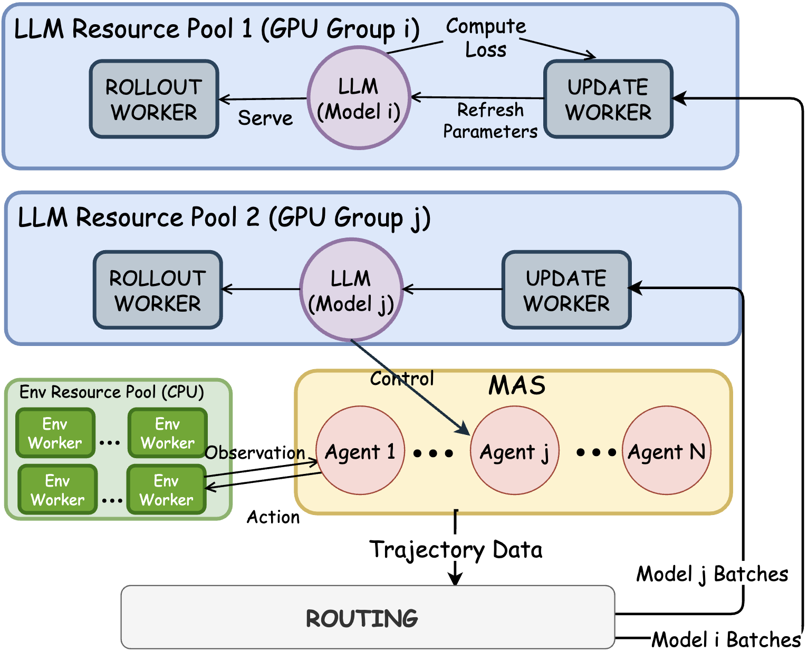

# Core Concepts

This page provides an overview of the core concepts in PettingLLMs.

## Multi-Agent Reinforcement Learning

PettingLLMs is built on the principle of **multi-agent reinforcement learning** where multiple LLM agents collaborate to solve complex tasks.

### Key Concepts

**Agents**: Specialized LLM agents with specific roles (e.g., Planner, Executor, Coder, Tester)

**Policies**: Neural network policies that control agent behavior. PettingLLMs supports:
- **Role-sharing policies**: Single policy shared across all agents
- **Role-specialized policies**: Separate policies for each agent role

**Environments**: Task-specific environments that agents interact with:
- Game environments (Sudoku, Sokoban)
- Planning environments (Plan-Path)
- Code environments (APPS, CodeContests)
- Math environments (AIME, OlympiadBench)

**Trajectories**: Sequences of observations, actions, and rewards collected during agent-environment interaction

## AT-GRPO Algorithm

AT-GRPO (Agent- and Turn-wise Group Relative Policy Optimization) is the core training algorithm in PettingLLMs.

### Key Features

1. **Agent-wise Grouping**: Groups rollouts by agent role for specialized learning
2. **Turn-wise Grouping**: Groups rollouts by conversation turn for temporal learning
3. **Tree-structured Sampling**: Samples multiple trajectories from shared prefixes
4. **Mixed Rewards**: Combines global task rewards with local agent rewards

See [AT-GRPO Algorithm](at-grpo.md) for detailed explanation.

## Training System Architecture

PettingLLMs uses a distributed training architecture:

<div align="center">

</div>

### Components

**RolloutWorkers**: 
- Run inference to collect trajectories
- Pinned to specific GPUs
- Refresh policy weights before each rollout
- Support batched sampling

**UpdateWorkers**:
- Perform policy optimization
- Pinned to separate GPUs
- Train on fresh rollout data only
- Support gradient accumulation

**EnvWorkers**:
- Run on CPUs
- Execute environment logic
- Sandbox agent actions
- Compute rewards

**Router**:
- Dispatches observations to correct agents
- Routes trajectories to appropriate policies
- Manages multi-policy coordination

See [Training System](training-system.md) for detailed architecture.

## Multi-Agent Workflows

PettingLLMs implements different agent workflows for different task domains:

### Game/Planning Workflow

```
Tool agent → executes tools
    ↓
Plan agent → Plan final action
    ↓
[Repeat until goal or budget]
```

### Code Workflow

```
Tester → writes/refines tests
    ↓
Coder → implements/refines code
    ↓
Environment → runs tests
    ↓
[Repeat until tests pass or budget]
```

### Math Workflow

```
Tool Agent → uses calculator/Python
    ↓
Reasoner → produces final answer
    ↓
Environment → verifies answer
    ↓
[Repeat until correct or budget]
```

See [Multi-Agent Workflows](workflows.md) for detailed examples.

## Training vs. Evaluation

### Training (Multi-Agent)

- Multiple specialized agents collaborate
- Turn-by-turn interaction
- Intermediate rewards guide learning
- Terminates on success or turn budget


## Policy Types

### Role-Sharing Policy

- **Single policy** controls all agents
- Agents differentiated by system prompts
- Suitable for tasks where roles are similar
- More sample efficient

### Role-Specialized Policies

- **Separate policy** for each agent role
- Each policy fine-tuned for specific role
- Suitable for tasks requiring distinct skills
- Better final performance


## Reward Structure

PettingLLMs uses a mixed reward structure:

### Global Rewards
- Based on overall task success
- Same reward for all agents
- Encourages coordination

### Local Rewards
- Based on individual agent actions
- Different for each agent
- Encourages specialization

### Example: Game Task

```python
# Global reward: Test pass rate
global_reward = final env reword

# Local rewards
tool_agent_reward= the action of tool agent execution  reward
plan_agent_reward= the action of plan agent execution reward

# Combined
final_reward = alpha * global_reward + local_reward
```

## Configuration System

PettingLLMs uses a hierarchical configuration system:

```
pettingllms/config/
├── <task>/
│   ├── single_policy.py    # Role-sharing config
│   └── two_policy.py       # Role-specialized config
└── ppo_trainer/
    └── trainer_config.py   # Trainer config
```

Each config specifies:
- Model architecture
- Agent roles and prompts
- Environment settings
- Reward structure
- Training hyperparameters

## Next Steps

Dive deeper into core concepts:

- Understand the training algorithm: [AT-GRPO Algorithm](at-grpo.md)
- Learn about distributed training: [Training System](training-system.md)
- Explore agent specialization levels: [Three-Level Specialization](three-level-specialization.md)

