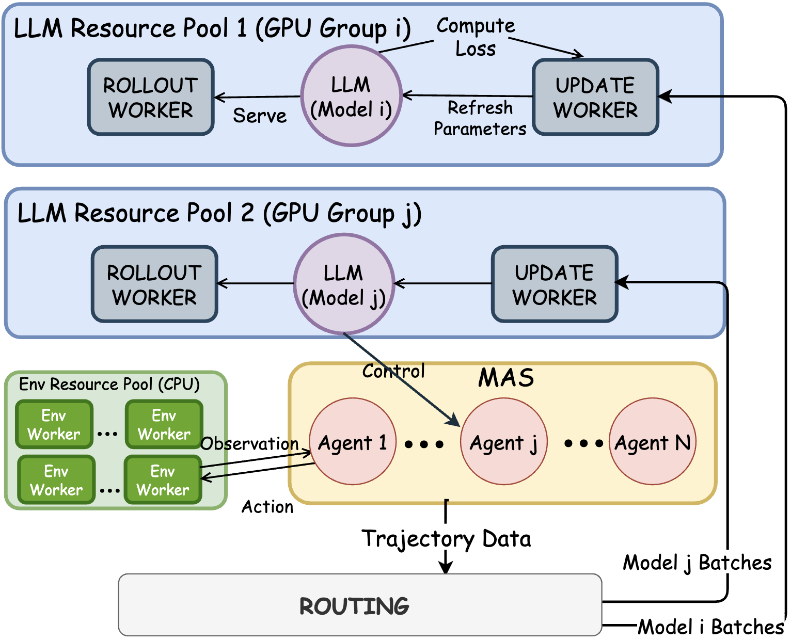

# Training System Architecture

PettingLLMs uses a distributed, GPU-efficient training system designed for multi-agent on-policy RL.

<div align="center">

</div>

## System Overview

The training system consists of four main components:

1. **RolloutWorkers** - Inference for trajectory collection
2. **UpdateWorkers** - Policy optimization
3. **EnvWorkers** - Environment execution
4. **Router** - Data routing and coordination

## Architecture

### Per-Policy GPU Pools

Each policy has dedicated GPU resources:

```
Policy 1 (Planner)          Policy 2 (Executor)
    ├─ RolloutWorker (GPU 0)    ├─ RolloutWorker (GPU 2)
    └─ UpdateWorker (GPU 1)     └─ UpdateWorker (GPU 3)
```

**Benefits**:
- No GPU contention between policies
- Parallel training of multiple policies
- Efficient resource utilization

### RolloutWorkers

**Responsibility**: Collect trajectories through agent-environment interaction

```python
class RolloutWorker:
    def __init__(self, policy, gpu_id):
        self.policy = policy
        self.gpu = gpu_id
    
    def collect_rollouts(self, env_batch):
        # Refresh policy weights (strict on-policy)
        self.policy.load_latest_weights()
        
        # Batched inference
        trajectories = []
        for env in env_batch:
            obs = env.reset()
            done = False
            
            while not done:
                # Model inference
                action = self.policy.act(obs)
                
                # Environment step
                next_obs, reward, done = env.step(action)
                
                # Store trajectory
                trajectories.append({
                    "obs": obs,
                    "action": action,
                    "reward": reward,
                    "done": done,
                })
                
                obs = next_obs
        
        return trajectories
```

**Key Features**:
- Strict on-policy: Always uses latest policy weights
- Batched inference for efficiency
- GPU-pinned for fast inference

### UpdateWorkers

**Responsibility**: Train policies on collected trajectories

```python
class UpdateWorker:
    def __init__(self, policy, gpu_id):
        self.policy = policy
        self.gpu = gpu_id
        self.optimizer = Adam(policy.parameters())
    
    def update(self, trajectories):
        # Only use fresh trajectories
        assert all(t.is_fresh for t in trajectories)
        
        # Compute advantages (AT-GRPO)
        advantages = self.compute_advantages(trajectories)
        
        # PPO updates
        for epoch in range(ppo_epochs):
            for batch in create_batches(trajectories):
                # Compute loss
                loss = self.compute_ppo_loss(batch, advantages)
                
                # Backward and optimize
                loss.backward()
                self.optimizer.step()
                self.optimizer.zero_grad()
        
        # Save updated weights
        self.policy.save_weights()
```

**Key Features**:
- Only trains on fresh (on-policy) data
- Implements AT-GRPO advantage computation
- GPU-pinned for fast training

### EnvWorkers

**Responsibility**: Execute environment logic

```python
class EnvWorker:
    def __init__(self, env_config):
        self.env = create_env(env_config)
    
    def step(self, action):
        # Execute action in sandboxed environment
        next_state, reward, done, info = self.env.step(action)
        
        return {
            "state": next_state,
            "reward": reward,
            "done": done,
            "info": info,
        }
```

**Key Features**:
- Run on CPUs (many parallel instances)
- Sandboxed execution for safety
- Deterministic seeding for reproducibility

### Router

**Responsibility**: Coordinate multi-agent system

```python
class Router:
    def __init__(self, agent_configs):
        self.agents = agent_configs
        self.policy_map = create_policy_map(agent_configs)
    
    def route_observation(self, obs, agent_id):
        # Determine which agent should act
        policy_id = self.policy_map[agent_id]
        
        # Send to appropriate rollout worker
        return self.rollout_workers[policy_id].act(obs)
    
    def route_trajectory(self, trajectory):
        # Determine which policy to train
        policy_id = self.policy_map[trajectory.agent_id]
        
        # Send to appropriate update worker
        self.update_workers[policy_id].add_data(trajectory)
```

**Key Features**:
- Routes observations to correct agents
- Routes trajectories to correct policies
- Handles both role-sharing and role-specialized setups

## Training Pipeline

### 1. Initialization

```python
# Initialize workers
rollout_workers = [
    RolloutWorker(policy, gpu_id)
    for policy, gpu_id in policy_gpu_map.items()
]

update_workers = [
    UpdateWorker(policy, gpu_id)
    for policy, gpu_id in policy_gpu_map.items()
]

env_workers = [
    EnvWorker(env_config)
    for _ in range(num_env_workers)
]

router = Router(agent_configs)
```

### 2. Rollout Phase

```python
# Collect trajectories
all_trajectories = []

for batch_idx in range(num_batches):
    # Assign environments to workers
    env_batch = env_workers[batch_idx]
    
    # Collect rollouts (parallel across policies)
    trajectories = collect_parallel(
        rollout_workers, 
        env_batch, 
        router
    )
    
    all_trajectories.extend(trajectories)
```

### 3. Update Phase

```python
# Route trajectories to policies
for policy_id in policies:
    # Get trajectories for this policy
    policy_trajectories = [
        t for t in all_trajectories
        if router.get_policy(t.agent_id) == policy_id
    ]
    
    # Train policy
    update_workers[policy_id].update(policy_trajectories)
```

### 4. Iteration

```python
for iteration in range(num_iterations):
    # Rollout phase
    trajectories = rollout_phase()
    
    # Update phase
    update_phase(trajectories)
    
    # Logging and checkpointing
    log_metrics(trajectories)
    save_checkpoint(iteration)
```


## Next Steps

Continue exploring core concepts:

- Understand the RL algorithm: [AT-GRPO Algorithm](at-grpo.md)
- Learn about agent specialization: [Three-Level Specialization](three-level-specialization.md)
- Return to concepts overview: [Core Concepts](overview.md)

