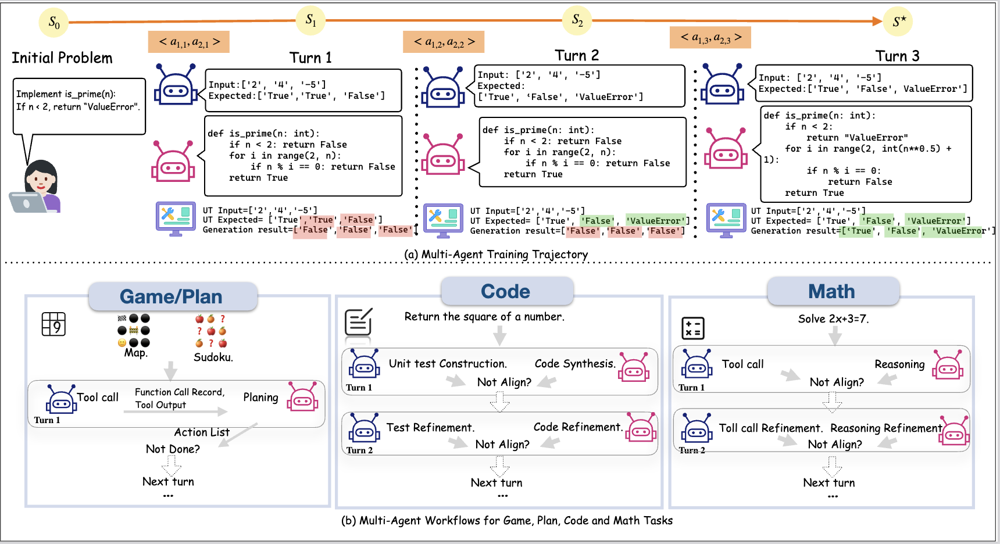

# Multi-Agent Workflows

PettingLLMs implements different agent workflows optimized for different task domains.

<div align="center">

</div>

## Workflow Overview

| Domain | Agents | Workflow Type | Termination |
|--------|--------|---------------|-------------|
| Games | Planner + Executor | Sequential | Goal or Budget |
| Planning | Planner + Executor | Sequential | Goal or Budget |
| Code | Tester + Coder | Iterative Refinement | Tests Pass or Budget |
| Math | Tool Agent + Reasoner | Tool-Augmented | Correct or Budget |

## Game/Planning Workflow

For Sudoku, Sokoban, and Plan-Path tasks.

### Multi-Agent Workflow

```
┌─────────────────────────────────────┐
│  Initial State                      │
└───────────┬─────────────────────────┘
            │
            ▼
┌─────────────────────────────────────┐
│  Planner Agent                      │
│  - Observes current state           │
│  - Proposes next action             │
└───────────┬─────────────────────────┘
            │
            ▼
┌─────────────────────────────────────┐
│  Executor Agent                     │
│  - Executes action via tools        │
│  - Returns new state & observation  │
└───────────┬─────────────────────────┘
            │
            ▼
        [Goal Reached?]
         ├─ Yes → Success (reward = 1.0)
         └─ No  → Repeat or Terminate
```

### Reward Structure

```python
# Step rewards (intermediate)
step_reward = -0.01  # Small penalty per step

# Terminal rewards
if goal_reached:
    terminal_reward = 1.0
elif budget_exceeded:
    terminal_reward = -1.0
else:
    terminal_reward = 0.0

# Total reward
total_reward = sum(step_rewards) + terminal_reward
```

### Example: Sokoban

```
Turn 1:
  Planner: "Move box at (2,3) up to target (2,2)"
  Executor: *executes* → "Box moved to (2,2). 1 of 4 boxes on target."
  Reward: -0.01

Turn 2:
  Planner: "Move to box at (4,4)"
  Executor: *executes* → "Moved to (3,4)."
  Reward: -0.01

...

Turn N:
  Planner: "Move last box to (5,5)"
  Executor: *executes* → "All boxes on target! Goal reached."
  Reward: 1.0 (terminal)
```

### Single-Agent Workflow

For comparison, single-agent workflow:

```
┌─────────────────────────────────────┐
│  Single Agent                       │
│  - Observes initial state           │
│  - Generates complete plan          │
│  - Executes all actions             │
└───────────┬─────────────────────────┘
            │
            ▼
        [Goal Reached?]
         ├─ Yes → Reward = 1.0
         └─ No  → Reward = 0.0
```

## Code Workflow

For APPS, CodeContests, and LiveCodeBench tasks.

### Multi-Agent Workflow

```
┌─────────────────────────────────────┐
│  Problem Description                │
└───────────┬─────────────────────────┘
            │
            ▼
┌─────────────────────────────────────┐
│  Tester Agent                       │
│  - Analyzes problem                 │
│  - Writes/refines unit tests        │
└───────────┬─────────────────────────┘
            │
            ▼
┌─────────────────────────────────────┐
│  Coder Agent                        │
│  - Reads tests                      │
│  - Writes/refines implementation    │
└───────────┬─────────────────────────┘
            │
            ▼
┌─────────────────────────────────────┐
│  Environment                        │
│  - Runs tests                       │
│  - Returns pass/fail results        │
└───────────┬─────────────────────────┘
            │
            ▼
        [All Tests Pass?]
         ├─ Yes → Success
         └─ No  → Refine and Repeat
```

### Reward Structure

```python
# Per-turn rewards (test pass rate)
test_pass_rate = passed_tests / total_tests

# Local rewards
tester_reward = test_coverage_score
coder_reward = code_quality_score

# Combined
turn_reward = (
    0.7 * test_pass_rate +  # Global
    0.15 * tester_reward +   # Local (tester)
    0.15 * coder_reward      # Local (coder)
)

# Terminal bonus
if all_tests_pass:
    terminal_bonus = 1.0
```

### Example: APPS Problem

```
Turn 1:
  Tester: "Test: input=[1,2,3], expected_output=6"
  Coder: "def sum_list(arr): return sum(arr)"
  Environment: "2/3 tests passed"
  Reward: 0.67

Turn 2:
  Tester: "Add edge case: input=[], expected_output=0"
  Coder: "def sum_list(arr): return sum(arr) if arr else 0"
  Environment: "3/3 tests passed"
  Reward: 1.0 + terminal_bonus
```

### Single-Agent Workflow

```
┌─────────────────────────────────────┐
│  Single Agent                       │
│  - Reads problem                    │
│  - Generates code                   │
│  - No refinement loop               │
└───────────┬─────────────────────────┘
            │
            ▼
        [Tests Pass?]
         ├─ Yes → Reward = 1.0
         └─ No  → Reward = 0.0
```

## Math Workflow

For AIME24, AIME25, and OlympiadBench tasks.

### Multi-Agent Workflow

```
┌─────────────────────────────────────┐
│  Problem Statement                  │
└───────────┬─────────────────────────┘
            │
            ▼
┌─────────────────────────────────────┐
│  Tool Agent                         │
│  - Performs calculations            │
│  - Executes Python code             │
│  - Returns intermediate results     │
└───────────┬─────────────────────────┘
            │
            ▼
┌─────────────────────────────────────┐
│  Reasoner Agent                     │
│  - Interprets results               │
│  - Plans next steps                 │
│  - Produces final answer            │
└───────────┬─────────────────────────┘
            │
            ▼
┌─────────────────────────────────────┐
│  Verifier                           │
│  - Checks answer correctness        │
│  - Returns exact match result       │
└───────────┬─────────────────────────┘
            │
            ▼
        [Answer Correct?]
         ├─ Yes → Success (reward = 1.0)
         └─ No  → Try Again or Terminate
```

### Reward Structure

```python
# Intermediate rewards (solution progress)
progress_reward = solution_progress_score

# Final answer reward
if answer_correct:
    answer_reward = 1.0
elif answer_close:  # Within error margin
    answer_reward = 0.5
else:
    answer_reward = 0.0

# Total reward
total_reward = 0.3 * progress_reward + 0.7 * answer_reward
```

### Example: AIME Problem

```
Problem: "Find the sum of all positive integers n such that..."

Turn 1:
  Tool: *computes* "n=1: sum=0, n=2: sum=3, n=3: sum=6"
  Reasoner: "Pattern suggests sum = n*(n-1)/2"
  Reward: 0.3 (progress)

Turn 2:
  Tool: *verifies pattern* "Confirmed for n=1..10"
  Reasoner: "Need n*(n-1)/2 < 100, so n < 15"
  Reward: 0.5 (progress)

Turn 3:
  Tool: *computes* "sum of valid n = 105"
  Reasoner: "Final answer: 105"
  Verifier: "Correct!"
  Reward: 1.0 (success)
```

### Single-Agent Workflow

```
┌─────────────────────────────────────┐
│  Single Agent                       │
│  - Reads problem                    │
│  - Reasons with optional tool calls │
│  - Produces answer                  │
└───────────┬─────────────────────────┘
            │
            ▼
        [Answer Correct?]
         ├─ Yes → Reward = 1.0
         └─ No  → Reward = 0.0
```

## Workflow Comparison

### Multi-Agent vs Single-Agent

| Aspect | Multi-Agent | Single-Agent |
|--------|-------------|--------------|
| **Turns** | Multiple | Single |
| **Refinement** | Iterative | None |
| **Intermediate Rewards** | Yes | No |
| **Specialization** | Role-specific | Generic |
| **Performance** | Higher (after training) | Lower |

### Termination Conditions

All workflows terminate when:

1. **Success**: Goal reached, tests pass, or answer correct
2. **Budget**: Maximum turns exhausted
3. **Failure**: Explicit failure state (rare)

## Configuration

Workflow behavior is configured per task:

```python
# Example: Code workflow config
config = {
    "max_turns": 10,
    "agents": ["tester", "coder"],
    "termination": "tests_pass_or_budget",
    "rewards": {
        "global": 0.7,
        "local": 0.3,
    }
}
```

## Next Steps

- Learn about the [Training System](training-system.md)
- Explore [Training Guides](../training/overview.md)
- Check [Benchmark Results](../results/benchmarks.md)

